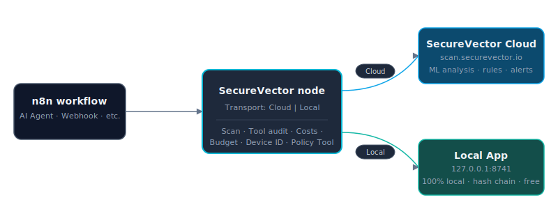
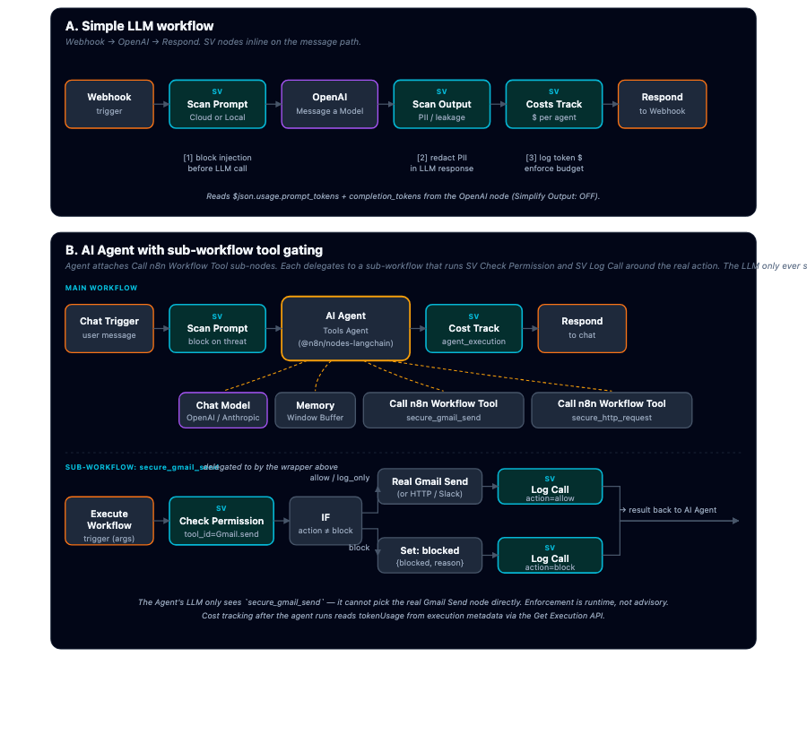

# n8n-nodes-securevector

[](https://www.npmjs.com/package/@securevector/n8n-nodes-securevector)
[](LICENSE)

**AI prompt security scanning for n8n workflows.** Detect prompt injection, jailbreak attempts, and 17+ threat categories in real-time.

> **⚠️ LEGAL DISCLAIMER**: This software is provided "AS-IS" without warranties. SecureVector makes NO guarantees about security effectiveness. Users assume ALL risk and liability. See [License](#license) for full terms.

## Quick Start

### Installation

**Via n8n Community Nodes** (Recommended):
1. Go to **Settings** → **Community Nodes** → **Install**
2. Enter: `@securevector/n8n-nodes-securevector`
3. Restart n8n

**Via npm**:
```bash
cd ~/.n8n && npm install @securevector/n8n-nodes-securevector
```

### Setup

<p align="center"></p>

The node supports **two transports**, chosen per-node via the `Transport` field:

| | **Cloud** (default) | **Local App** |
|---|---|---|
| Endpoint | `scan.securevector.io` | `http://127.0.0.1:8741` (your machine) |
| Signup / API key | Required (`sv_xxxxx`) | None — runs on your laptop |
| Available operations | `Scan Prompt` only | All v0.2.0 operations (scan, tool audit, cost tracking, budget, device ID) |
| **Pros** | ML-driven analysis (Llama Guard + Bedrock Claude), continuously-updated threat-intel rule library, team alerts via Slack / email / webhooks, custom AI-generated rules tuned to your industry | Runs **100% on your machine** — prompts never leave your network. Tamper-evident hash chain. Free, open-source, no signup. |
| **Best for** | Production workflows where you want SOC-grade detection + team notifications | Indie devs, regulated industries, anyone who wants prompts to stay local |

You can mix transports across nodes in the same workflow — e.g., scan with Cloud (better detection), audit + cost-track with Local App.

---


1. **Get an API key** — [open the dashboard](https://app.securevector.io/dashboard?section=access) (or navigate: SecureVector App → Access Management → Create API Key). Format: `sv_xxxxx`.
2. Add the SecureVector node to your workflow.
3. Leave **Transport = Cloud** (default) and configure the credential.

---


Install + run the local app on your machine:

```bash
pip install securevector-ai-monitor[app]
securevector-app --web
```

Then add the SecureVector node to your workflow and set **Transport = Local App**. No credential needed.

---

## Local App — v0.2.0 operations

All operations below are **local-only** — they require Transport = Local App and depend on machine-local state (hash chain, per-user cost history, device identity).

| Operation | Endpoint | What it does |
|---|---|---|
| **Prompt → Scan Prompt** | `POST /analyze` | Same as cloud — scan a user prompt. |
| **Prompt → Scan Output** | `POST /analyze` (llm_response=true) | Scan an LLM response for PII / secret / leakage. |
| **Tools → Check Permission** | `GET /api/tool-permissions/essential` + `/custom` | Ask the app whether a tool call is allowed, blocked, or log-only. |
| **Tools → Log Call** | `POST /api/tool-permissions/call-audit` | Append a tamper-evident audit row. |
| **Tools → Verify Chain** | `GET /api/tool-permissions/call-audit/integrity` | Walk the hash chain, return `{ok, total, tampered_at}`. |
| **Costs → Check Budget** | `GET /api/costs/budget-status` | Today's spend vs configured budget. |
| **Costs → Track** | `POST /api/costs/track` | Record one LLM call's token usage. |
| **System → Get Device ID** | `GET /api/system/device-id` | Stable per-machine identifier (for fleet attribution). |

### Canonical workflow patterns

<p align="center"></p>

The diagram above shows the two canonical patterns. **Panel A** is the simple inline pattern — drop SV nodes between a trigger, an LLM node, and a respond node: scan the prompt before, scan the output after, track cost on the way out. **Panel B** is the AI Agent pattern — the agent attaches `Call n8n Workflow Tool` sub-nodes (n8n's built-in tool sub-node, not a SecureVector node) and each one delegates to a sub-workflow that runs `SV → Tool → Check Permission` before invoking the real action. The LLM only ever sees the wrapper name (e.g. `secure_gmail_send`), so the policy check is unavoidable at runtime.

**Static LLM workflow — cost-gated content generation:**

```
[Schedule hourly]
  → [SV Check Budget, agent_id=content-bot]
    → IF over_budget = true → [Slack alert] → stop
    → else                  → [OpenAI Message-a-Model, Simplify Output: OFF]
                               → [SV Track Cost, source=openai_native,
                                     input_tokens = {{$json.usage.prompt_tokens}},
                                     output_tokens = {{$json.usage.completion_tokens}}]
                               → [Publish to CMS]
```

**Static tool-gating — customer-support chatbot with injection protection:**

```
[Webhook]
  → [SV Scan Prompt, Block on Threat: ON]
    → allow → [OpenAI] → [SV Scan Output, Block on Threat: ON]
                           → allow → [Respond to Webhook]
                           → block → [Respond with fallback] + [SV Log Call action=block]
    → block → [Respond with polite refusal]
```

### Token paths vary by upstream LLM node

The SecureVector app never counts tokens itself — it reads what the provider already returned. The `source` dropdown on `Costs → Track` tells the node where to read from:

| Upstream node | Source | Reads from |
|---|---|---|
| OpenAI "Message a Model" (core) | `openai_native` | `$json.usage.prompt_tokens` / `completion_tokens` (Simplify Output OFF) |
| LangChain Chat Model attached to a Basic LLM Chain | `langchain_chain` | `$json.response.generations[0][0].generationInfo.tokenUsage.{promptTokens, completionTokens}` |
| AI Agent (Tools Agent) | `agent_execution` | `Get Execution` API fallback — the AI Agent node does not expose tokens in `$json` ([long-standing n8n issue](https://community.n8n.io/t/retrieve-llm-token-usage-in-ai-agents/68714)) |

### Gating AI Agent tool calls (Local App transport)

n8n's verified-community-node rules let each package ship at most one non-trigger node, so this package does not include a Tool sub-node — the gating happens via a sub-workflow that wraps each real tool. The pattern preserves machine-enforced policy checks (the LLM physically cannot invoke the unwrapped tool) while keeping the package Cloud-verifiable.

#### Prerequisite — register tool actions in the SecureVector app

Open <http://localhost:8741> → **Tool Permissions** and set each `tool_id` (e.g. `Gmail.send`, `HTTP.request`) to `allow`, `block`, or `log_only`. The `Tool → Check Permission` operation reads from `/api/tool-permissions/essential` + `/api/tool-permissions/custom` at runtime, so app-side changes take effect without restarting n8n.

#### Workflow shape

```
Main workflow:
  [Trigger] → [AI Agent (Tools Agent)]
                ← Chat Model                          (OpenAI / Anthropic / Ollama)
                ← Memory                              (Window Buffer)
                ← Call n8n Workflow Tool              ← n8n's built-in tool sub-node
                    (workflow id = secure_gmail_send)
                ← Call n8n Workflow Tool
                    (workflow id = secure_http_request)

Sub-workflow "secure_gmail_send" (workflow id pasted above):
  [Execute Workflow Trigger]
    → [SecureVector · Tool · Check Permission · tool_id=Gmail.send]
        → IF $json.action === 'allow'
              → [Real Gmail Send]
              → [SecureVector · Tool · Log Call · action=allow]
              → return result
          IF $json.action === 'log_only'
              → [SecureVector · Tool · Log Call · action=log_only]
              → [Real Gmail Send]
              → return result
          IF $json.action === 'block'
              → [SecureVector · Tool · Log Call · action=block]
              → [Set: { blocked: true, reason: $json.reason }]
              → return
```

#### Why this works

The agent's LLM only ever sees the wrapper tool (e.g., `secure_gmail_send`) — it cannot pick `Gmail Send` directly. By the time the LLM invokes the wrapper, the sub-workflow runs server-side and the policy check is unavoidable. Prompt-engineering the agent to "always run a permission check first" is unreliable; this enforces it at the runtime layer.

#### Tool description for the LLM

Configure the **Description** field on each `Call n8n Workflow Tool` so the LLM picks the wrapped variant naturally and handles the block branch:

> *"Send an email via Gmail. Returns `{blocked: true, reason}` when SecureVector policy denies the call — apologize to the user and stop."*

#### Caching note

`Tool → Check Permission` performs two HTTP calls per invocation against the local app. If you wrap many tools in the same agent run, expect that overhead per call. The local app is on `127.0.0.1:8741` so latency is sub-millisecond; no additional caching is needed.

## Operation Modes

| Mode | Use Case | Behavior | Configuration | Diagram |
|------|----------|----------|---------------|---------|
| **Non-Blocking** | Analysis & logging | Returns scan results, workflow continues regardless of threat | `Block on Threat`: OFF | `Trigger → SecureVector → Next Node` |
| **Blocking** | Security gate | Stops workflow if threat detected | `Block on Threat`: ON<br>`Threshold`: 0-100<br>`Risk Levels`: Select | `Trigger → SecureVector → [STOP if threat] → Next Node` |
| **Parallel** | Real-time monitoring | Scan + LLM run simultaneously | `Block on Threat`: OFF<br>Split workflow | `Trigger ──┬→ SecureVector`<br>`          └→ LLM → Merge` |

### Mode Details

**🔓 Non-Blocking (Default)**
```
User Input → SecureVector Scan → IF Node (score > 50?)
                                      ├─ TRUE → Alert Team
                                      └─ FALSE → Send to LLM
```
**Use for**: Logging, metrics, conditional routing

---

**🔒 Blocking (Security Gate)**
```
User Input → SecureVector Scan → LLM Processing
             [THROWS ERROR IF THREAT DETECTED - WORKFLOW STOPS]
```
**Use for**: Preventing malicious prompts from reaching LLM

---

**⚡ Parallel (Async Analysis)**
```
User Input ──┬→ SecureVector Scan ──┐
             └→ LLM Processing ──────→ Merge → Results
```
**Use for**: Performance-critical workflows

## Parameters

| Parameter | Type | Default | Description |
|-----------|------|---------|-------------|
| `prompt` | string | - | Text to scan (max 10,000 chars, truncated if longer) |
| `timeout` | number | 30 | Scan timeout in seconds (1-300) |
| `includeMetadata` | boolean | false | Include workflow ID in request |
| `blockOnThreat` | boolean | false | Stop workflow on threat detection |
| `threatThreshold` | number | 50 | Score threshold for blocking (0-100) |
| `blockOnRiskLevels` | array | `['critical', 'high']` | Risk levels that trigger blocking |

## Output Format

```json
{
  "scanId": "550e8400-e29b-41d4-a716-446655440000",
  "score": 85,
  "riskLevel": "high",
  "threats": [
    {
      "category": "prompt_injection",
      "severity": "high",
      "title": "Potential prompt injection detected",
      "description": "...",
      "confidence": 0.92
    }
  ],
  "timestamp": "2025-12-27T10:30:00.000Z",
  "metadata": {
    "processingTimeMs": 150,
    "version": "1.0.0"
  }
}
```

**Scoring**: 0 = safe, 100 = maximum threat

**Risk Levels**: `safe`, `low`, `medium`, `high`, `critical`

**17 Threat Categories**: prompt_injection, adversarial_attack, model_extraction, data_poisoning, privacy_leak, bias_exploitation, model_inversion, membership_inference, backdoor_attack, evasion_attack, jailbreak_attempt, sensitive_data_exposure, inappropriate_content, malicious_code_generation, social_engineering, misinformation_generation, privilege_escalation

## Data Privacy

**What data is sent to SecureVector API?**

This node sends **ONLY** the following data to the SecureVector API for analysis:

1. **Input data** - Any content you provide in the `prompt` parameter (text, prompts, data, or any other input you want analyzed)
2. **Metadata** (optional) - Only if `includeMetadata` is enabled:
   - Workflow ID
   - Execution ID
   - Source identifier (`n8n-workflow`)

**Why is this data sent and stored?**

- **Analysis**: Your input is analyzed for security threats and returned with a threat score
- **Your auditing**: All data you send is **persisted for your own logging and auditing purposes** - this allows you to review scan history, track which workflows triggered scans, and maintain audit trails

**What is NOT sent?**

- API keys or credentials
- Other node data or variables not explicitly provided
- Workflow configuration or logic
- Any data from other nodes in your workflow

**Important**: Anything you send for analysis will be stored by SecureVector for your auditing and logging purposes. Only send data you consent to being analyzed and stored.

**Data retention**: See [SecureVector Privacy Policy](https://securevector.io/privacypolicy) for details on how scan data is stored and retained.

## Examples

Importable workflow JSONs in [`examples/`](examples/). Pick the one that matches what you're testing — open it in n8n via **+ Add workflow → ⋯ → Import from File**.

### Local App (v0.2.0+)
| File | What it covers | Imports needed |
|---|---|---|
| [`test-workflow-smoke.json`](examples/test-workflow-smoke.json) | **Smallest possible test.** Manual Trigger → SV Get Device ID → SV Verify Audit Chain. Confirms Local App transport works end-to-end with no LLM credentials. | None — runs against the local app on `127.0.0.1:8741` |
| [`test-workflow-scan-and-block.json`](examples/test-workflow-scan-and-block.json) | **Full scan + audit + cost demo.** Set test inputs → SV Scan Prompt → IF threat → SV Audit (block/allow branches) → SV Cost Track. Exercises 4 of the new operations. | None |
| [`test-workflow-ai-agent.json`](examples/test-workflow-ai-agent.json) | **AI Agent with sub-workflow tool gating.** Chat Trigger → SV Scan input → AI Agent (Tools Agent) attaching `Call n8n Workflow Tool — secure_gmail_send` → SV Cost Track. Pair with the sub-workflow below. | OpenAI / Anthropic / Ollama credential, the imported sub-workflow's ID pasted into the `Call n8n Workflow Tool` node, and an n8n API key (Settings → API → Create API Key) — `agent_execution` cost source reads tokenUsage from the Get Execution API |
| [`test-workflow-real-tool-stub.json`](examples/test-workflow-real-tool-stub.json) | **Sub-workflow the wrapper delegates to.** Execute Workflow Trigger → `SV Check Permission` (`tool_id=Gmail.send`) → IF action ≠ block → (allow path: Real Gmail Send stub + `SV Log Call` action=allow) / (block path: `{blocked, reason}` + `SV Log Call` action=block). Stub Set node fakes the real action; replace with a real Gmail / HTTP / Slack node. | Used as a sub-workflow target — paste its workflow ID into the `Call n8n Workflow Tool` node above |

### Cloud (v0.1.5 patterns)
| File | What it covers |
|---|---|
| [`non-blocking-analysis.json`](examples/non-blocking-analysis.json) | Conditional routing — scan, then route on the result |
| [`blocking-mode.json`](examples/blocking-mode.json) | Security gate — scan throws if BLOCK, halting the workflow |
| [`parallel-analysis.json`](examples/parallel-analysis.json) | Async scanning — scan in parallel with the LLM call |

### Recommended order

1. **Smoke** (`test-workflow-smoke.json`) — confirm the Local App transport works in your n8n install.
2. **Scan + audit + cost** (`test-workflow-scan-and-block.json`) — confirm the new v0.2.0 operations end-to-end against the local app.
3. **AI Agent with tool gating** (`test-workflow-ai-agent.json` + `test-workflow-real-tool-stub.json`) — import the sub-workflow first, copy its workflow ID into the `Call n8n Workflow Tool` node in the main workflow, then trigger a chat message that asks the agent to send an email.

## Troubleshooting

| Issue | Solution |
|-------|----------|
| "Invalid API key" | Verify key format: `sv_xxxxx` at [app.securevector.io](https://app.securevector.io) |
| "Timeout" | Increase timeout parameter or check network |
| "Rate limit exceeded" | Wait 60s or upgrade plan |
| Node not appearing | Restart n8n after installation |

## Support

- **Documentation**: [docs.securevector.io](https://docs.securevector.io)
- **Issues**: [GitHub Issues](https://github.com/Secure-Vector/n8n-nodes-securevector/issues)
- **Security**: Report to security@securevector.io (see [SECURITY.md](SECURITY.md))

## Development

```bash
git clone https://github.com/Secure-Vector/n8n-nodes-securevector.git
cd n8n-nodes-securevector
npm install
npm test          # Run tests
npm run build     # Build dist/
npm link          # Link to local n8n
```

See [CONTRIBUTING.md](CONTRIBUTING.md) for guidelines.

## License

Licensed under [MIT License](LICENSE).

### DISCLAIMER

**THIS SOFTWARE IS PROVIDED "AS IS", WITHOUT WARRANTY OF ANY KIND, EXPRESS OR IMPLIED, INCLUDING BUT NOT LIMITED TO THE WARRANTIES OF MERCHANTABILITY, FITNESS FOR A PARTICULAR PURPOSE AND NONINFRINGEMENT.**

**SecureVector makes NO representations or warranties about:**
- The accuracy, reliability, or completeness of security scans
- The detection or prevention of security threats
- The suitability for any particular purpose

**Users assume ALL risk and liability for:**
- Use of this software in production environments
- Any security breaches, data loss, or damages
- Compliance with applicable laws and regulations

**This node is a TOOL ONLY. It does not guarantee security.** Users are solely responsible for implementing comprehensive security measures.

By using this software, you acknowledge that **SecureVector shall not be liable for any claims, damages, or losses** arising from its use.

---

**Copyright © 2025 SecureVector. All rights reserved.**

## Security Notes

### Development Dependencies
`npm audit` may show a critical vulnerability in `form-data` (via `n8n-workflow`). **This does not affect the published package** because:

- `n8n-workflow` is a **peer dependency** (provided by n8n runtime, not bundled)
- Our package only bundles `zod` (no vulnerabilities)
- Our code uses **JSON requests**, not multipart/form-data
- The vulnerability would need to be fixed in n8n core, not this package

For the latest security updates, keep your n8n installation up to date.

### Reporting Security Issues
Report security issues to: security@securevector.io
